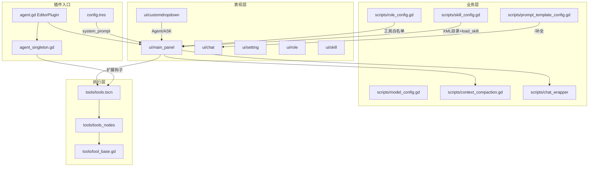

# 架构概览

Alpha Agent 是一个纯 Godot 编辑器插件，全部功能集中在 `addons/agent/` 目录下，无独立游戏场景。

## 模块关系



## 目录结构

```
addons/agent/
├── agent.gd              # 插件入口（EditorPlugin）
├── agent_singleton.gd    # 跨模块桥接单例 + 扩展钩子
├── config.tres           # 系统提示词与版本号
├── scripts/              # 配置与 LLM 适配
│   ├── model_config.gd   # 多供应商/多模型管理
│   ├── role_config.gd    # 角色与人设、工具权限
│   ├── skill_config.gd   # Skill 文件夹管理
│   ├── context_compaction.gd  # Token 估算与上下文压缩
│   ├── prompt_template_config.gd  # Prompt 模板管理
│   ├── test/             # Mock Provider 测试
│   └── chat_wrapper/     # 7 家 LLM 供应商适配器
├── tools/                # AI 工具系统
│   ├── tool_base.gd      # 工具基类 AgentToolBase
│   ├── tools.gd          # 工具注册、调度、截断、钩子
│   ├── tools.tscn        # 工具场景（注册表）
│   └── tools_nodes/      # 37 个具体工具实现
├── ui/                   # 编辑器 Dock UI
│   └── customdropdown/   # Agent/ASK 模式下拉
├── skills/               # Skill 资源与 19 个内置 Skill
├── prompts/              # 内置 Prompt 模板
├── prompt/               # 系统提示词源文件
├── utils/                # 通用辅助函数
└── icons/                # UI 图标
```

## 核心设计模式

1. **单例桥接**：`AlphaAgentSingleton` 解耦工具/UI 与 `EditorPlugin`，提供场景树等待、autoload 操作、扩展钩子
2. **信号驱动 UI**：`setting_ready`、`models_changed`、`roles_changed`、`chat_mode_changed` 等信号协调各面板
3. **多层工具过滤**：ASK 模式 → 角色白名单 → 只读回退，由 `_get_effective_tools_list()` 统一决策
4. **Skill 渐进披露**：系统提示注入 XML 目录，完整内容通过 `load_skill` 按需加载
5. **配置分层**：全局 `setting.{version}.json` + 项目 `res://.alpha/settings.json` 覆盖
6. **配置版本化**：持久化文件名含 `alpha_version`，便于插件升级时迁移

## 相关文档

| 文档 | 说明 |
|------|------|
| [插件生命周期](plugin-lifecycle.md) | 启停流程、GlobalSetting、单例信号 |
| [数据持久化](data-persistence.md) | 配置路径与 JSON schema |
| [工具系统架构](tool-system.md) | 工具注册、并行执行、截断 |
| [聊天流程](../features/chat-flow.md) | 消息循环、Compaction、Steering |
| [扩展钩子 API](../features/extension-api.md) | before/after tool_call |
