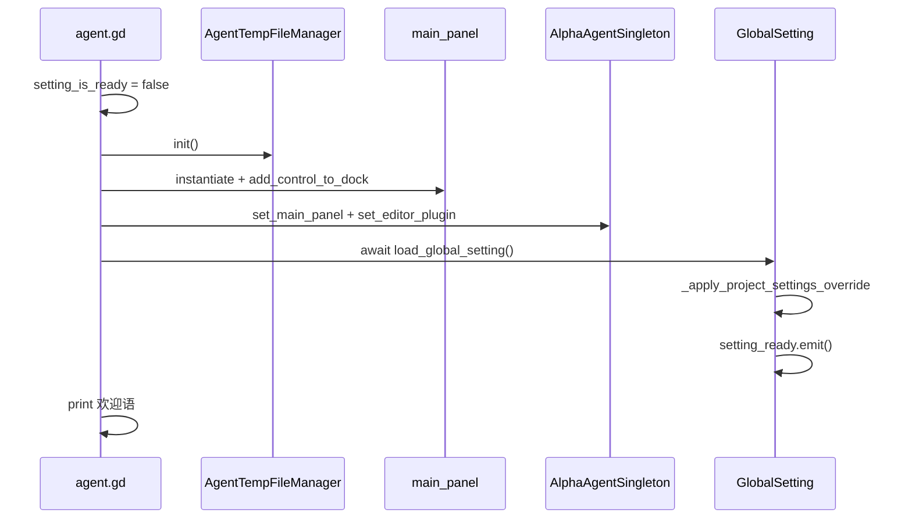

# 插件生命周期

## 关键文件

| 文件 | 职责 |
|------|------|
| `addons/agent/agent.gd` | `EditorPlugin` 入口，内嵌 `GlobalSetting` |
| `addons/agent/agent_singleton.gd` | 跨模块桥接单例、扩展钩子 |
| `addons/agent/ui/main_panel.gd` | 主面板编排，等待 `setting_ready` |

## 启用流程（`_enter_tree`）

步骤说明：

1. 复位 `global_setting.setting_is_ready = false`，防止插件重载时面板跳过初始化
2. 初始化 `AgentTempFileManager`（文件编辑备份）
3. 实例化 `main_panel.tscn`，挂载到 `DOCK_SLOT_RIGHT_UL`
4. `AlphaAgentSingleton` 绑定 `main_panel` 与 `EditorPlugin`
5. `await global_setting.load_global_setting()` 加载配置并初始化各 Manager
6. 发出 `setting_ready` 信号，各 UI 面板据此完成懒加载初始化

## 禁用流程（`_exit_tree`）

1. 从 Dock 移除并 `queue_free()` `main_panel`
2. `AlphaAgentSingleton` 清空 `main_panel` 与 `editor_plugin` 引用

## GlobalSetting

`GlobalSetting` 定义在 `agent.gd` 内，通过 `AlphaAgentPlugin.global_setting` 静态访问。

### load_global_setting 顺序

1. 确保 `setting_dir` 目录存在
2. 读取 `setting.{version}.json` 填充 UI 选项字段
3. `_apply_project_settings_override()` — 读取 `res://.alpha/settings.json` 覆盖
4. 初始化 `ModelManager`（`models_file`）
5. 初始化 `RoleManager`（`roles_file`）；若角色为空，等待一帧后创建默认角色
6. 初始化 `SkillManager`（`skill_directory`）
7. 初始化 `PromptTemplateManager`（`prompts_{version}/`）
8. 设置 `setting_is_ready = true` 并 `emit setting_ready`

### setting_ready 消费者

设置页、技能页、记忆页等面板在首次可见或 `_ready` 时 `await global_setting.setting_ready`，避免在 Manager 未就绪时访问数据。

## AlphaAgentSingleton 信号契约

| 信号 | 参数 | 触发方 | 消费者 |
|------|------|--------|--------|
| `update_plan_list` | `Array[PlanItem]` | `update_plan_list` 工具 | `plan_list.gd` |
| `models_changed` | 无 | 模型管理 UI | `input_container` 刷新模型选择器 |
| `roles_changed` | 无 | 角色管理 UI | `input_container` 刷新角色选择器 |
| `chat_mode_changed` | `mode: String` | `custom_dropdown` | 外部扩展监听 |
| `before_tool_call` | `ToolCallsInfo` | `AgentTools.use_tool` | 扩展钩子 |
| `after_tool_call` | `ToolCallsInfo`, `result` | `AgentTools.use_tool` | 扩展钩子 |
| `before_agent_finish` | `finish_reason`, `total_tokens` | `main_panel` | 扩展钩子 |

### 桥接能力

- `get_scene_tree()` / `wait_for_scene_tree_frame()`：供工具和 Manager 在插件环境中等待帧
- `add_autoload_singleton()` / `remove_autoload_singleton()`：代理到 `EditorPlugin`
- `main_panel` / `editor_plugin`：工具与 UI 访问编辑器能力的统一入口
- `register_tool_call_interceptor()`：注册工具执行拦截器

## 全局静态状态

定义在 `agent.gd` 底部：

| 变量 | 说明 |
|------|------|
| `project_memory` | 项目级记忆，注入 system prompt |
| `global_memory` | 全局记忆，注入 system prompt |
| `is_chat_stopped` | 对话是否已停止，工具循环据此中断 |

## 扩展指南

- 新增 Manager：在 `load_global_setting()` 中初始化，文件名遵循 `{name}.{version}.json` 规则
- 新增需等待就绪的面板：连接 `global_setting.setting_ready` 或 `await` 该信号
- 跨模块通知 UI：优先通过 `AlphaAgentSingleton` 信号，避免直接耦合 `main_panel` 子节点
- 扩展工具行为：连接 `before_tool_call` / `after_tool_call`，或注册拦截器

相关文档：[扩展钩子 API](../features/extension-api.md)、[数据持久化](data-persistence.md)
