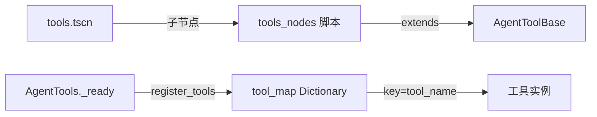
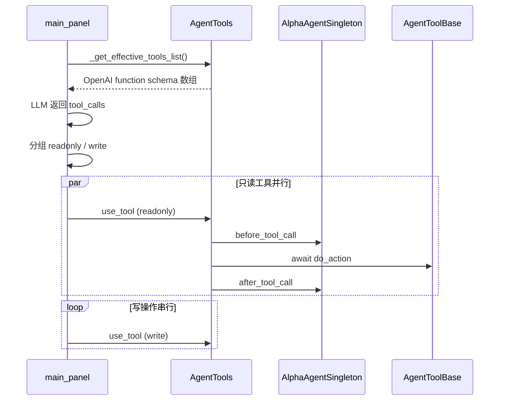

# 工具系统架构

## 关键文件

| 文件 | 职责 |
|------|------|
| `tools/tool_base.gd` | 抽象基类 `AgentToolBase`，定义 `ToolGroup` 枚举 |
| `tools/tools.gd` | 注册表 `AgentTools`，调度、截断、扩展钩子 |
| `tools/tools.tscn` | 工具场景，每个子节点挂载一个工具脚本 |
| `tools/tools_nodes/*.gd` | 37 个具体工具实现 |

## 注册机制



`AgentTools._ready()` 遍历所有子节点，将 `AgentToolBase` 实例按 `tool_name` 注册到 `tool_map`。

## ToolGroup 分组

定义于 `tool_base.gd`：

| 枚举值 | 名称 | 典型工具 |
|--------|------|----------|
| `QUERY` | 查询操作 | `read_file`, `get_project_info`, `global_search` |
| `FILE` | 文件操作 | `write_file`, `create_script` |
| `SCENE` | 场景操作 | `add_node_to_scene`, `create_animation` |
| `EDITOR` | 编辑器操作 | `open_resource`, `update_script_file_content` |
| `COMMAND` | 命令行操作 | `execute_command` |
| `DEBUG` | 调试操作 | `check_script_error` |
| `PROJECT` | 项目配置操作 | `input_mapping_actions` |

`tool_readonly` 属性标记只读工具，用于 ASK 模式过滤与并行执行分组。

## 调度流程



### 工具列表 API

| 方法 | 说明 |
|------|------|
| `get_tools_list()` | 全部工具 schema |
| `get_filtered_tools_list(names)` | 按白名单过滤 |
| `get_readonly_tools_list()` | 仅 `tool_readonly == true` |
| `is_tool_readonly(name)` | 判断是否只读 |

### use_tool

1. `AlphaAgentSingleton.emit_before_tool_call()`
2. 执行注册的 `tool_call_interceptors`（返回 true 则拦截）
3. 从 `tool_call.function.name` 查找 `tool_map`
4. `await tool.do_action(tool_call)` 执行
5. `truncate_tool_output()` 截断超长 JSON（默认 12000 字符）
6. `AlphaAgentSingleton.emit_after_tool_call()`
7. 未找到工具名时返回 `{"error": "错误的function.name"}`

### 输出截断

`MAX_TOOL_OUTPUT_CHARS = 12000`，在 `use_tool()` 返回前统一截断，防止大文件/长输出撑爆上下文。

## OpenAI Function Schema

每个工具通过 `get_tool_func_description()` 生成：

```json
{
  "type": "function",
  "function": {
    "name": "read_file",
    "description": "...",
    "parameters": { "type": "object", "properties": {...}, "required": [...] }
  }
}
```

`parameters` 由子类 `_get_tool_parameters()` 定义。

## 工具权限链路

```
CustomDropdown (Agent/ASK)
  → main_panel._get_effective_tools_list()
RoleManager.current_role.tools[]
  → get_filtered_tools_list() 或 get_readonly_tools_list()
  → ChatStream.tools
  → LLM function calling
```

详见 [角色系统](../features/roles.md)。

## 扩展钩子

通过 `AlphaAgentSingleton` 扩展，无需修改 `tools.gd`：

- `before_tool_call` / `after_tool_call` 信号
- `register_tool_call_interceptor(callback)` 拦截器

详见 [扩展钩子 API](../features/extension-api.md)。

## 扩展指南

新增工具三步：

1. 在 `tools_nodes/` 创建脚本，继承 `AgentToolBase`，实现全部抽象方法
2. 在 `tools.tscn` 添加子节点并挂载脚本
3. 在 `docs/features/tools/` 对应文档中补充条目

写操作工具应设 `_get_tool_readonly() -> false`，查询类工具返回 `true` 以支持 ASK 模式与并行执行。

详细实现模板见 [工具开发指南](../features/tools/developer-guide.md)。
