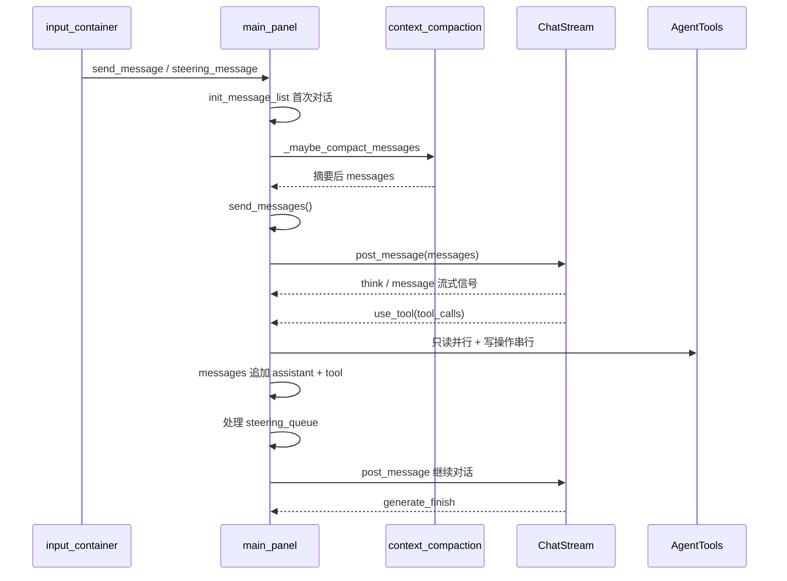

# 聊天流程

## 关键文件

| 文件 | 职责 |
|------|------|
| `ui/main_panel.gd` | 消息编排、LLM 实例化、工具循环、Compaction、Steering |
| `ui/chat/input_container.gd` | 用户输入、Agent/ASK 模式、Steering 发送 |
| `ui/chat/message_item.gd` | 单条消息渲染 |
| `tools/tools.gd` | 工具调度、截断、扩展钩子 |
| `scripts/context_compaction.gd` | Token 估算与上下文压缩 |

## 数据流



## 消息 Dictionary Schema

`main_panel.messages` 为 `Array[Dictionary]`，遵循 OpenAI Chat Completions 格式：

| role | 字段 | 说明 |
|------|------|------|
| `system` | `content`, `id` | 由 `init_message_list()` 构建，含记忆、角色 prompt、Skill 目录、ASK 模式提示 |
| `user` | `content`, `id` | 用户消息 |
| `assistant` | `content`, `reasoning_content`, `tool_calls`, `id` | 助手回复或纯工具调用 |
| `tool` | `tool_call_id`, `content`, `id` | 工具执行结果（JSON 字符串） |

同一轮 assistant 回复与后续 tool 消息共用同一个 `id`（`current_random_message_id`）。

Compaction 后可能追加一条 `role: system` 的 `[上下文压缩摘要]` 消息。

## init_message_list

首次对话时构建 system 消息：

```gdscript
CONFIG.system_prompt.format({
    "project_memory": ...,
    "global_memory": ...,
    "role_prompt": current_role.prompt
}) + skill_xml_summary + ask_mode_hint
```

- **Skill 目录**：`SkillManager.get_skills_xml_summary()` 注入 `<available_skills>` XML
- **ASK 模式**：追加只读模式说明文字

占位符定义见 `config.tres` / `scripts/config.gd`。

## send_messages

1. 设置 `is_chat_stopped = false`
2. `await _maybe_compact_messages()` — 超阈值时 LLM 摘要旧消息
3. 按 `supplier.provider` 工厂式创建 `*ChatStream` 和 `*Chat`（标题生成用）
4. 配置 `api_base`、`model_name`、`max_tokens`、`use_thinking`
5. 绑定流式信号：`think`、`message`、`use_tool`、`generate_finish`、`error`
6. `current_chat_stream.tools = _get_effective_tools_list()` — 见下方工具过滤
7. 创建 `message_item`，调用 `post_message(messages)`

### 工具过滤（_get_effective_tools_list）

| 优先级 | 条件 | 工具集 |
|--------|------|--------|
| 1 | ASK 模式 | `get_readonly_tools_list()` |
| 2 | 有角色且 tools 非空 | `get_filtered_tools_list(role.tools)` |
| 3 | 无角色或 tools 为空 | `get_readonly_tools_list()`（安全回退） |

## on_use_tool

1. `current_message_item.used_tools(tool_calls)` 展示工具调用 UI
2. 追加 assistant 消息（含 `tool_calls` 和 `reasoning_content`）
3. `_execute_tool_calls()`：
   - **只读工具**：`_execute_readonly_tools_parallel()` 并行执行
   - **写操作工具**：串行 `await tools.use_tool()`
4. 追加 tool 消息，更新 UI 结果
5. 若 `steering_queue` 非空，弹出一条 steering 用户消息注入上下文
6. `reset_message_info()` 后再次 `post_message(messages)` 继续对话

## 上下文 Compaction

详见 [上下文压缩](context-compaction.md)。

触发条件：`contextTokens > contextWindow - reserveTokens`（默认 reserve 4096）。

流程：找切分点 → LLM 摘要旧消息 → 在 system 后插入摘要 → 保留近期消息。

## Steering 消息队列

对话生成中（`generatting`）或工具执行中（`_is_tool_executing`）用户仍可发送消息：

- `input_container` 发出 `steering_message` 信号（而非 `send_message`）
- `main_panel` 将消息放入 `_steering_queue`
- 当前 tool loop 结束后，从队列取出一条注入 `messages` 再继续

## Token 用量显示

`on_agent_finish` 累加 `_session_total_tokens`，调用 `input_container.set_usage_label()` 显示 `已用/窗口` 百分比。

## 流式 UI 更新

| 信号 | 处理函数 | UI 行为 |
|------|----------|---------|
| `think` | `on_agent_think` | 累加 `current_think`，更新 thinking 区域 |
| `message` | `on_agent_message` | 累加 `current_message`，更新正文 |
| `response_use_tool` | `on_response_use_tool` | 标记消息进入工具调用状态 |
| `generate_finish` | `on_agent_finish` | 结束本轮，保存历史，展示编辑文件列表 |

## 中断机制

- 用户点击停止：`is_chat_stopped = true`，`current_chat_stream.close()`
- `on_use_tool` / 并行工具循环中检测 `is_chat_stopped`，提前 return

## 扩展指南

- 修改 system prompt 模板：编辑 `config.tres` 或 `prompt/system_zh.md`
- 新增消息类型渲染：在 `message_item.gd` 添加分支
- 工具循环钩子：连接 `AlphaAgentSingleton.before_tool_call` / `after_tool_call`
- 对话结束钩子：连接 `before_agent_finish`

相关文档：[聊天 UI](ui/chat.md)、[Chat Wrapper](chat-wrapper.md)、[上下文压缩](context-compaction.md)、[工具系统架构](../architecture/tool-system.md)
