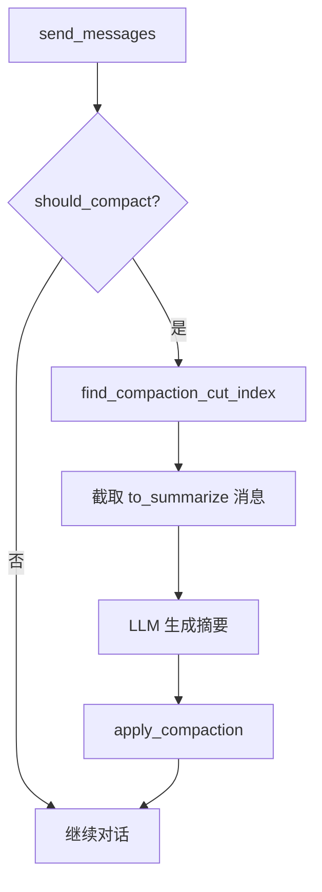

# 上下文压缩（Compaction）

## 关键文件

| 文件 | 职责 |
|------|------|
| `scripts/context_compaction.gd` | Token 估算、切分点计算、摘要 prompt、应用压缩 |
| `ui/main_panel.gd` | `_maybe_compact_messages()`、`_request_compaction_summary()` |

## 背景

LLM 上下文窗口有限。长对话会导致 API 报错或丢失早期信息。Compaction 在超阈值时将旧消息摘要为一条 system 消息，保留近期完整上下文。

借鉴 Pi Agent Harness 的 Compaction 设计，当前为 Alpha Agent 的 GDScript 实现。

## 触发条件

```gdscript
contextTokens > contextWindow - reserveTokens
```

| 参数 | 默认值 | 说明 |
|------|--------|------|
| `contextWindow` | `model.max_tokens * 16` 或 128000 | 由 `_get_context_window()` 计算 |
| `reserveTokens` | 4096 | 为模型回复预留空间 |
| `keepRecentTokens` | 20000 | 从最新消息向前保留的 token 估算量 |

在 `send_messages()` 开头调用 `await _maybe_compact_messages()`。

## 流程



1. **找切分点**：从最新消息向前累加 token 估算，达到 `keepRecentTokens` 的位置即为 `cut_index`
2. **生成摘要**：调用当前 provider 的 `*Chat` 非流式类，传入 `build_compaction_prompt()`
3. **应用压缩**：保留原 system 消息 → 插入 `[上下文压缩摘要]` system 消息 → 追加 `cut_index` 之后的近期消息
4. **回退**：LLM 摘要失败时使用 `_fallback_compaction_summary()` 截断拼接

## Token 估算

`estimate_tokens(text)` 使用字符数 / 4 的启发式估算（`CHARS_PER_TOKEN_ESTIMATE = 4`）。

估算 messages 时计入 `content`、`reasoning_content`、`tool_calls` JSON。

## 与 Token 显示的关系

`main_panel._session_total_tokens` 在 `on_agent_finish` 累加 API 返回的 `total_tokens`，通过 `input_container.set_usage_label()` 显示用量百分比。

Compaction 在发送前基于估算 token 触发，与 API 返回的实际用量互补。

## 未实现（路线图）

- 在 `history.json` 中记录独立 `compaction` entry（Pi Phase 3）
- 可配置 `reserveTokens` / `keepRecentTokens` 设置项
- 手动 `/compact` 命令触发

## 扩展指南

- 调整阈值：修改 `AgentContextCompaction` 常量或 `_get_context_window()`
- 自定义摘要 prompt：编辑 `build_compaction_prompt()`
- 替换摘要模型：在 `_request_compaction_summary()` 中指定专用 Chat 实例

相关文档：[聊天流程](chat-flow.md)、[Chat Wrapper](chat-wrapper.md)
