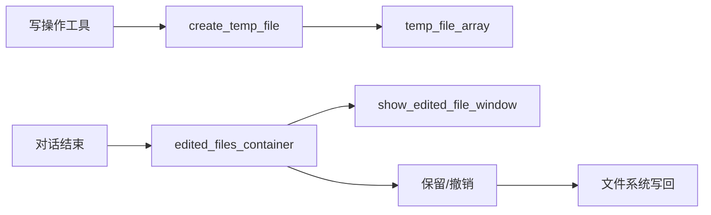

# 文件编辑回滚

## 关键文件

| 文件 | 职责 |
|------|------|
| `tools/tool_utils/temp_file_manager.gd` | 编辑前备份管理 |
| `utils/diff_utils.gd` | Myers diff 算法 |
| `ui/edit_file/edited_files_container.gd` | 修改文件列表 UI |
| `ui/edit_file/show_edited_file_window.gd` | 双栏 diff 对比窗口 |
| `ui/edit_file/edited_file_item.gd` | 单文件操作项 |

## EditedFile 结构

```gdscript
class EditedFile:
    var target_path: String    # 被修改的文件路径
    var origin_exist: bool     # 是否有原始文件（false = 新创建）
    var origin_path: String    # 备份临时文件路径
```

备份目录：`OS.user_data_dir/.alpha/temp/`

## 触发备份的工具

以下工具在首次修改文件前调用 `AgentTempFileManager.create_temp_file(path)`：

| 工具 | 文件 |
|------|------|
| `write_file` | `write_file_tool.gd` |
| `update_script_file_content` | `update_script_file_content_tool.gd` |
| `set_resource_property` | `set_resource_property_tool.gd` |

`create_temp_file` 逻辑：

1. 若 `target_path` 已在 `temp_file_array` 中，跳过
2. 若原文件存在，复制到 `temp/` 目录作为备份
3. 追加到 `temp_file_array`

## 展示时机

对话结束（`on_agent_finish`）时，若 `temp_file_array` 非空，调用 `show_edited_file_container()` 展示修改文件列表。

## 用户操作

| 操作 | 行为 |
|------|------|
| 查看 diff | 打开 `show_edited_file_window`，双栏对比原文与现文 |
| 保留更改 | 删除备份文件，从 `temp_file_array` 移除 |
| 撤销更改 | 用备份内容覆盖 `target_path`，删除备份 |

diff 算法使用 `AgentDiffTool`（`diff_utils.gd`），支持同步滚动。

## 数据流



## 扩展指南

- 新增加工具有文件写入：在 `do_action` 开头调用 `create_temp_file(target_path)`
- 修改备份策略：编辑 `temp_file_manager.gd` 的 `create_temp_file` 方法

相关文档：[工具开发指南](tools/developer-guide.md)
