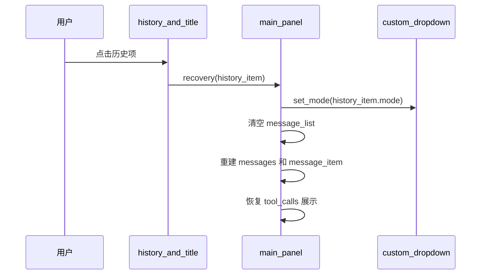

# 聊天历史

## 关键文件

| 文件 | 职责 |
|------|------|
| `ui/history/history_and_title.gd` | 标题栏、历史弹窗、持久化 |
| `ui/history/history_message_item.gd` | 历史列表单行 |
| `ui/main_panel.gd` | 标题生成、历史恢复、mode 保存 |

## HistoryItem 结构

```gdscript
class HistoryItem:
    var id: String
    var use_thinking: bool
    var message: Array[Dictionary]   # 完整 messages 数组（含 Compaction 摘要）
    var title: String
    var time: String
    var mode: String                 # "Agent" 或 "ASK"
```

持久化路径：`OS.user_data_dir/.alpha/history.json`

`mode` 在 `on_agent_finish` 时由 `_get_chat_mode()` 写入，恢复时通过 `custom_dropdown.set_mode()` 还原。

## 标题生成

对话开始后，`main_panel` 使用 `current_title_chat`（非流式 `*Chat` 类）根据首条用户消息生成标题。

- 限制 20 字符，超出截断加 `...`
- `history_and_title.set_title()` 更新标题栏显示

## 历史分组

弹窗按时间分为四组：

| 分组 | 条件 |
|------|------|
| 今日 | 当天 |
| 昨日 | 前一天 |
| 本周 | 本周内 |
| 更早 | 其余 |

## 恢复流程



`on_recovery_history()` 遍历 `history_item.message`，按 role 分支创建对应 `message_item`：

- `user`：显示用户内容
- `assistant`：显示正文、thinking、tool_calls
- `tool`：显示工具结果
- 含 `[上下文压缩摘要]` 的 system 消息：作为 messages 上下文保留，UI 跳过 system 渲染

## 保存时机

- 工具调用过程中：`on_use_tool` 末尾更新 `current_history_item`
- 对话结束：`on_agent_finish` 写入 `history.json`（含 `mode`、`use_thinking`）

## 扩展指南

- 修改历史 schema：同步更新 `HistoryItem.to_dict()` / `from_dict()`
- 新增分组：在 `add_history_nodes()` 中添加时间判断逻辑
- 会话分支（未实现）：可参考 Pi JSONL 树形会话，为 `HistoryItem` 增加 `parent_id`

相关文档：[聊天流程](chat-flow.md)、[数据持久化](../architecture/data-persistence.md)
