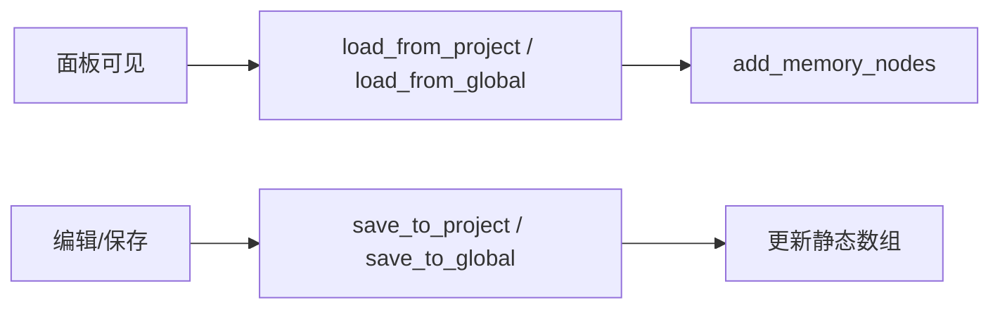

# 记忆系统

## 关键文件

| 文件 | 职责 |
|------|------|
| `ui/memory/memory_container.gd` | 全局/项目记忆 CRUD UI |
| `ui/memory/memory_item.gd` | 单条记忆编辑项 |
| `scripts/config.gd` | `AgentConfig`，含 `memory` 字段 |
| `agent.gd` | `project_memory` / `global_memory` 静态数组 |

## 两种记忆

| 类型 | 存储 | 作用域 | 注入方式 |
|------|------|--------|----------|
| 项目记忆 | `config.tres` 的 `memory` 字段 | 当前项目 | `AlphaAgentPlugin.project_memory` |
| 全局记忆 | `memory.{version}.json` | 跨项目 | `AlphaAgentPlugin.global_memory` |

## 注入时机

`main_panel.init_message_list()` 在首次对话时格式化 system prompt：

```gdscript
"project_memory": ''.join(project_memory.map(func(m): return "-" + m + "\n")),
"global_memory": ''.join(global_memory.map(func(m): return "-" + m + "\n")),
```

占位符定义在 `config.tres` 的 `system_prompt` 模板中。

## UI 数据流



### 懒加载策略

- `_ready` 时 `await setting_ready`（ONE_SHOT）
- `visibility_changed`：可见时渲染，隐藏时 `clear_memory_nodes()` 释放 DOM

### CRUD 操作

| 操作 | 全局记忆 | 项目记忆 |
|------|----------|----------|
| 添加 | `on_add_global_memory` | `on_add_project_memory` |
| 保存 | 写入 `memory.json` | 写入 `config.tres` 并 `ResourceSaver.save` |
| 删除 | 从数组移除并保存 | 从数组移除并保存 |

## 扩展指南

- 新增记忆类型：在 `AgentConfig` 添加字段，在 `init_message_list` 添加占位符
- 记忆条目格式：当前为 `Array[String]`，每条为纯文本

相关文档：[聊天流程](chat-flow.md)、[数据持久化](../architecture/data-persistence.md)
