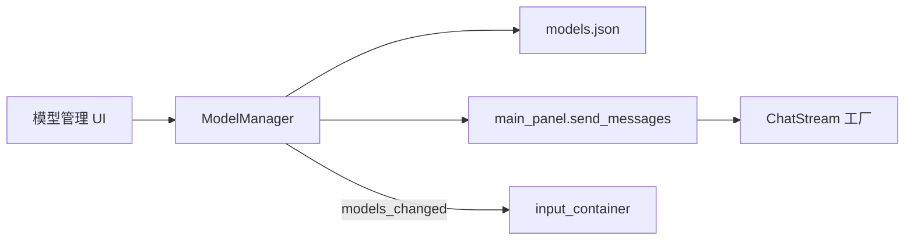

# 模型配置

## 关键文件

| 文件 | 职责 |
|------|------|
| `scripts/model_config.gd` | `SupplierInfo`、`ModelInfo`、`ModelManager` |
| `scripts/model_utils.gd` | `ToolCallsInfo`、HTTP 代理工具 |
| `ui/models/supplier_item.gd` | 供应商 CRUD UI |
| `ui/models/model_manager_window.gd` | 模型添加/编辑弹窗 |
| `ui/models/supplier_option_window.gd` | 预设供应商快速添加 |

## 数据结构

### SupplierInfo

| 字段 | 类型 | 说明 |
|------|------|------|
| `id` | String | 唯一标识 |
| `name` | String | 显示名称 |
| `base_url` | String | API Base URL |
| `api_key` | String | 访问密钥 |
| `provider` | String | 提供商类型，决定 ChatStream 类 |
| `models` | Array[ModelInfo] | 下属模型列表 |

### ModelInfo

| 字段 | 类型 | 说明 |
|------|------|------|
| `id` | String | 唯一标识 |
| `name` | String | 显示名称 |
| `model_name` | String | API 请求中的模型 ID |
| `supports_thinking` | bool | 是否支持深度思考 |
| `supports_tools` | bool | 是否支持工具调用 |
| `max_tokens` | int | 单次请求上限 |
| `active` | bool | 是否启用 |
| `supplier_id` | String | 所属供应商 |

## 持久化

文件：`EditorPaths.config_dir/.alpha/models.{version}.json`

由 `ModelManager` 在 `load_global_setting()` 时初始化，变更后调用 `save_models()`。

## 数据流

## UI 操作

| 操作 | 入口 | 调用 |
|------|------|------|
| 添加供应商 | 设置页 / Manage Models | `ModelManager.add_supplier()` |
| 添加模型 | 供应商展开 / 弹窗 | `SupplierInfo.models.append()` |
| 切换当前模型 | 输入区模型选择器 | `set_current_model()` |
| 远程拉取模型列表 | 模型管理弹窗 | HTTP GET `{base_url}/models` |
| 连通性验证 | 供应商项 | 发送测试请求 |

变更后通过 `AlphaAgentSingleton.models_changed` 刷新输入区选择器。

## 与 ChatStream 的关系

`supplier.provider` 字段在 `main_panel.send_messages()` 中决定实例化哪个 `*ChatStream` 类。详见 [Chat Wrapper](chat-wrapper.md)。

`model.supports_thinking` 与用户 UI 的 thinking 开关共同决定 `use_thinking`。
`model.supports_tools` 影响是否向 API 传递 tools 参数。

## 扩展指南

1. 在 `model_config.gd` 添加 provider 常量或验证
2. 实现 `chat_wrapper/{name}_chat_stream.gd` 和 `{name}_chat.gd`
3. 在 `main_panel.send_messages()` 添加工厂分支
4. 在 `ui/models/supplier_option_window.gd` 添加预设供应商
5. 更新 `docs/features/chat-wrapper.md` 映射表

相关文档：[Chat Wrapper](chat-wrapper.md)、[数据持久化](../architecture/data-persistence.md)
