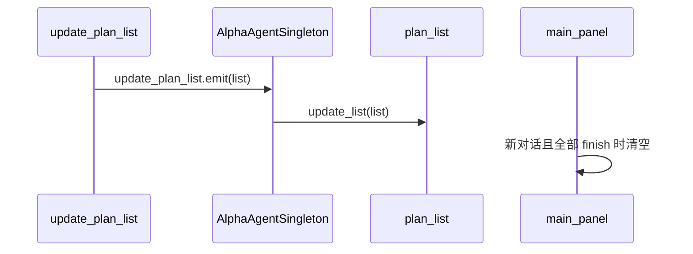

# 计划列表

## 关键文件

| 文件 | 职责 |
|------|------|
| `agent_singleton.gd` | `PlanItem`、`PlanState` 定义，`update_plan_list` 信号 |
| `tools/tools_nodes/update_plan_list.gd` | Agent 更新计划的工具 |
| `ui/plan/plan_list.gd` | 计划面板 UI |
| `ui/plan/plan_item.gd` | 单任务行 UI |

## 数据结构

### PlanState 枚举

| 值 | 字符串 | UI 表现 |
|----|--------|---------|
| `Plan` | `"plan"` | 待执行 |
| `Active` | `"active"` | 进行中 |
| `Finish` | `"finish"` | 已完成 |

### PlanItem

```gdscript
class PlanItem:
    var name: String
    var state: PlanState
```

## 工具契约

`update_plan_list` 工具参数 `tasks[]`：

```json
{
  "tasks": [
    {"name": "分析需求", "state": "active"},
    {"name": "编写代码", "state": "plan"}
  ]
}
```

约束：列表中应只有一个 `active` 状态任务，任务数量建议 5-10 个。

### 返回文案策略

| 条件 | success 消息 |
|------|-------------|
| `active_index == 0` | 开始执行当前任务 |
| `all_finished` | 所有任务均已完成 |
| `all_plan` | 开始执行第一项任务 |
| 其他 | 停止输出，等待用户确认 |

## 信号流



`plan_list.gd` 在 `_ready` 时连接 `singleton.update_plan_list`。

## 清空逻辑

`main_panel._clear_plan_list_if_all_finished()`：发送新消息前，若 `plan_list.is_all_finished()` 则 `update_list([])` 清空计划。

## 扩展指南

- 修改状态枚举：同步更新 `update_plan_list.gd` 的 match 分支和 `plan_item.gd` 图标
- 新增 UI 交互：在 `plan_list.gd` 监听信号后扩展

相关文档：[工具总索引](tools/index.md)、[聊天流程](chat-flow.md)
