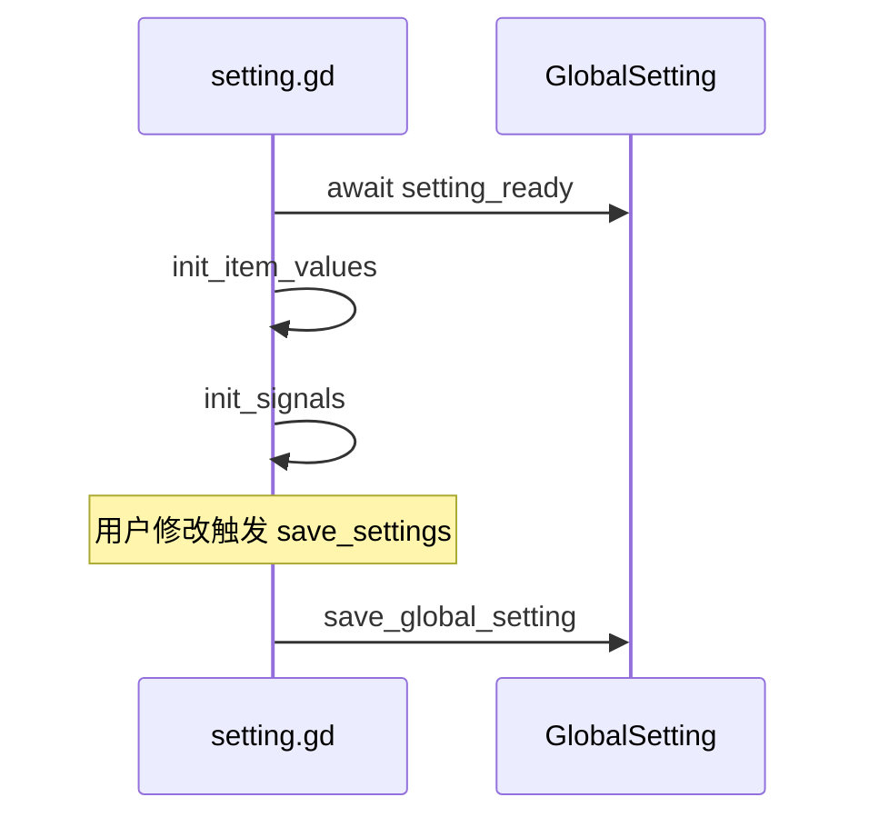

# 设置系统

## 关键文件

| 文件 | 职责 |
|------|------|
| `ui/setting/setting.gd` | 设置页容器 |
| `ui/setting/setting_item.gd` | 设置项基类 `AgentSettingItemBase` |
| `ui/setting/setting_item_bool.gd` | 布尔设置项 |
| `ui/setting/setting_item_option.gd` | 选项设置项 |
| `ui/setting/setting_item_string.gd` | 字符串设置项 |
| `agent.gd` | `GlobalSetting` 字段定义与持久化 |

## 设置层级

| 层级 | 路径 | 说明 |
|------|------|------|
| 全局 | `{config_dir}/.alpha/setting.{version}.json` | 用户级默认，设置页修改并保存 |
| 项目 | `res://.alpha/settings.json` | 项目级覆盖，启动时 `_apply_project_settings_override()` 合并 |

项目设置仅覆盖存在的字段，未声明的字段保持全局值。适合按项目配置代理、发送快捷键等。

### 项目设置示例

```json
{
  "http_proxy_host": "127.0.0.1",
  "http_proxy_port": "7890",
  "send_shortcut": 1
}
```

## 当前设置项

| setting_key | 类型 | GlobalSetting 字段 | 说明 |
|-------------|------|-------------------|------|
| `auto_clear` | bool | `auto_clear` | 发送后自动清空输入框 |
| `auto_expand_think` | bool | `auto_expand_think` | 自动展开思考内容 |
| `auto_add_file_ref` | bool | `auto_add_file_ref` | 自动添加文件引用 |
| `send_shortcut` | option | `send_shortcut` | 发送快捷键（Enter/Ctrl+Enter） |
| `http_proxy_host` | string | `http_proxy_host` | HTTP 代理地址 |
| `http_proxy_port` | string | `http_proxy_port` | HTTP 代理端口 |

`send_shortcut` 对应 `AlphaAgentPlugin.SendShotcut` 枚举（`None=0`, `Enter=1`, `CtrlEnter=2`）。

## 初始化流程



设置页采用懒加载：首次 `visibility_changed` 可见时 `_try_init()`。

注意：设置页保存的是**全局** `setting.{version}.json`；项目覆盖文件需手动编辑 `res://.alpha/settings.json`。

## 设置项基类

`AgentSettingItemBase` 定义：

- `setting_key: String`：对应 GlobalSetting 字段名
- `value_changed` 信号：值变更时触发
- `get_value()` / `set_value()` / `get_value_type()`：子类实现

`setting.gd` 的 `save_settings()` 根据 `setting_key` 写入 `GlobalSetting` 对应字段并调用 `save_global_setting()`。

## 内嵌管理入口

设置页还包含：

- **模型供应商列表**：`init_models_supplier()`，添加供应商按钮
- **角色管理入口**：`on_click_manage_role_button()` 打开角色窗口

## 新增设置项三步

1. **场景**：在 `setting.tscn` 添加对应 `setting_item_*` 子节点，设置 `setting_key`
2. **注册**：在 `setting.gd` 的 `setting_item_nodes` 数组中添加节点引用
3. **字段**：在 `GlobalSetting` 添加字段，在 `load_global_setting()` 读取、`save_global_setting()` 写入；若需项目覆盖，在 `_apply_project_settings_override()` 添加对应键

## 扩展指南

- 代理设置影响范围：`AgentModelUtils.apply_proxy_to_http_client()` 读取 `http_proxy_host/port`
- 发送快捷键：`input_container` 读取 `send_shortcut` 决定 Enter 行为
- Steering 发送：生成中 `disable=true` 且 Stop 按钮可见时，Enter 走 `steering_message` 而非新开对话

相关文档：[插件生命周期](../architecture/plugin-lifecycle.md)、[数据持久化](../architecture/data-persistence.md)
